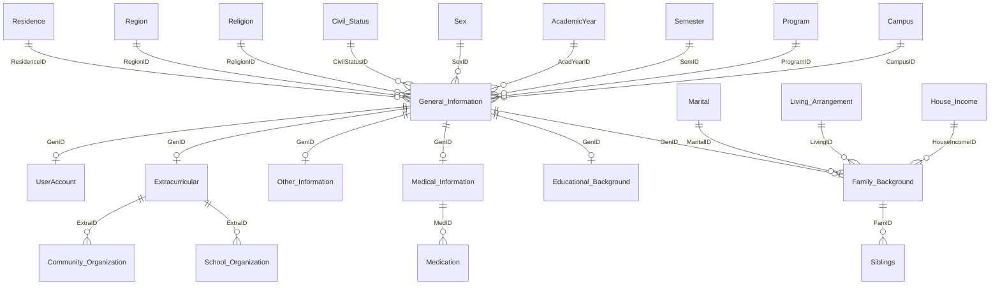

# Entity-Relationship Diagram — `PersonINFO`

The database is centered on **`General_Information`** (one row = one student).
Reference/lookup tables sit on the "one" side of each relationship, and detail tables
(Family, Education, Medical, etc.) sit on the "many" side.

## Relationship overview

> **New:** `UserAccount` was added on top of the original schema to support login. It has a
> one-to-(zero-or-one) relationship with `General_Information` (one student = one account),
> enforced by a `UNIQUE` constraint on `GenID`, plus a `UNIQUE` constraint on `Username`.

## Reading the diagram

- `||--o{` means **one-to-many**: one Campus has many students; one student has many siblings.
- `||--o|` means **one-to-(zero-or-one)**: a student has at most one Family / Medical / Other record.

## The three layers

**1. Lookup / reference tables** (the "one" side — small, fixed lists):
Campus, Semester, Program, Region, Religion, AcademicYear, Sex, Civil_Status, Residence,
Marital, Living_Arrangement, House_Income.

**2. Central record:**
`General_Information` — holds the core student identity and points to the lookups via
foreign keys (CampusID, ProgramID, SexID, …).

**3. Detail tables** (the "many" side — extra info about a student):
- `Family_Background` → children: `Siblings`
- `Educational_Background`
- `Medical_Information` → children: `Medication`
- `Extracurricular` → children: `School_Organization`, `Community_Organization`
- `Other_Information`

## Foreign keys (from the DDL)

| Child table | Column | References |
|---|---|---|
| General_Information | CampusID | Campus(CampusID) |
| General_Information | ProgramID | Program(ProgramID) |
| General_Information | SemID | Semester(SemID) |
| General_Information | AcadYearID | AcademicYear(AcadYearID) |
| General_Information | SexID | Sex(SexID) |
| General_Information | CivilStatusID | Civil_Status(CStatusID) |
| General_Information | ReligionID | Religion(ReligionID) |
| General_Information | RegionID | Region(RegionID) |
| General_Information | ResidenceID | Residence(ResidenceID) |
| Family_Background | GenID | General_Information(GenID) |
| Family_Background | MaritalID | Marital(MaritalID) |
| Family_Background | LivingID | Living_Arrangement(LivingID) |
| Family_Background | HouseIncomeID | House_Income(HouseIncome) |
| Siblings | FamID | Family_Background(FamID) |
| Educational_Background | GenID | General_Information(GenID) |
| Extracurricular | GenID | General_Information(GenID) |
| School_Organization | ExtraID | Extracurricular(ExtraID) |
| Community_Organization | ExtraID | Extracurricular(ExtraID) |
| Medical_Information | GenID | General_Information(GenID) |
| Medication | MedID | Medical_Information(MedID) |
| Other_Information | GenID | General_Information(GenID) |
| UserAccount | GenID | General_Information(GenID) *(also UNIQUE)* |
